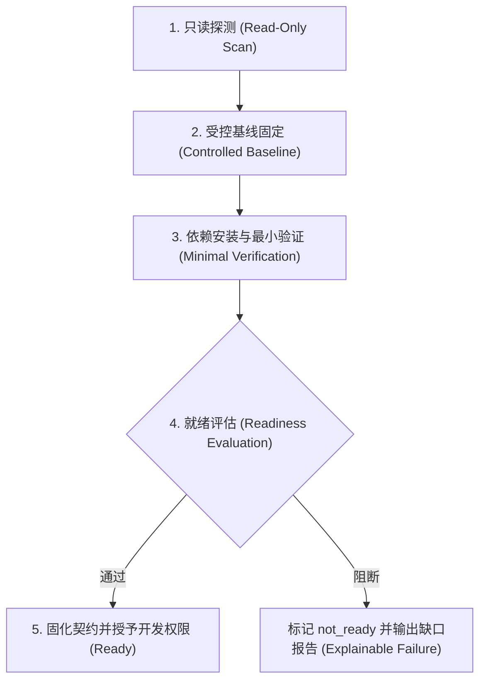

# Multigent 企业级演进与工程落地架构路线图 (Enterprise Evolution & Scale Roadmap)

本文档定义 Multigent 面向企业生产落地与分布式扩展的核心技术路线、优先级排期及设计原则。

---

## 1. 核心架构前提：单活控制面 + 分布式运行节点

### 1.1 破除伪分布式迷思
在当前阶段，**为了回应“分布式”而将控制面拆为微服务是反模式**。
- **存储现状**：当前系统核心状态库为 SQLite。直接多开控制面实例不仅无法获得高可用，反而会引入严重的单写者锁竞争、多节点调度抢占冲突和分布式状态一致性灾难。
- **真实瓶颈定位**：人机协作系统的算力与 I/O 瓶颈 **95% 在沙箱内部**（依赖下载、编译构建、单元测试、大模型上下文处理与容器磁盘 I/O），而控制面（REST API、任务调度、审计记录、IM 消息路由）的负载微乎其微。单个 SQLite 实例足以支撑每秒数千次事务。

### 1.2 目标拓扑结构
```text
                    Mattermost / GitLab / 企业内网用户
                                  │
                  集中式单活控制面 (Control Plane)
             (REST API / 调度引擎 / 审计流 / SQLite 状态库)
                                  │
             ┌────────────────────┼────────────────────┐
             ▼                    ▼                    ▼
      运行节点 A (Node-A)   运行节点 B (Node-B)   运行节点 C (Node-C)
      [Docker / Lina]      [Docker / Mira]      [Docker / QA-Agent]
```
- **控制面集中单活**：全局任务调度、状态机流转、IM 事件分发、审计日志及权限校验全部收口在控制面，保证状态绝对一致。
- **运行节点横向扩展**：通过 Runtime Nodes 将重型沙箱容器调度到不同物理机/VM。不同项目、不同 Agent 的任务可以在不同运行节点并发执行，低成本获得多机水平扩容能力。
- **真正的控制面高可用后置**：未来规模放大后，再平滑将 SQLite 升级为 PostgreSQL、任务队列租约化与对象存储解耦，避免在早期背负不必要的运维复杂度。

---

## 2. 优先级矩阵与演进排期

| 优先级 | 演进领域 | 核心关注点与价值 |
|---|---|---|
| **P0** | **存量仓库接入与就绪检查 (Brownfield Onboarding)** | 绝大多数企业真实场景是存量项目（已有代码库、历史包袱、私有依赖），而非空模板项目。这是平台从 Demo 迈向生产的分水岭。 |
| **P0** | **内网部署档案与 Mattermost 联通验收** | 网络、DNS、TLS、回调 URL 与 Bot 身份是企业内网部署的第一道鬼门关。配置错误会导致整条 ChatOps 链路瘫痪。 |
| **P1** | **并发与资源治理 (Concurrency & Governance)** | 隔离、限流、配额先行。必须证明多任务/多项目并发时的资源隔离与异常自愈，防止容器争抢打崩宿主机。 |
| **P1** | **测试质量治理 (Quality Governance)** | TDD 能提升下限但不能替代质量保证。打破“自写自测自过”的幻觉，建立独立 QA 审查与 Signoff 追溯矩阵。 |
| **P2** | **大需求自动拆分与 Goal 树产品化** | 自动无限递归派生子任务极易导致幻觉扩散与状态爆炸。先降级为规范约束，待底层能力扎实后再做 UI 与产品化。 |

---

## 3. P0：存量仓库接入就绪检查 (Brownfield Onboarding Gate)

### 3.1 五步受控就绪流水线
存量项目必须通过独立的只读与最小验证流水线，严禁未经验证直接赋予 Agent 写入权限：



1. **只读探测 (Read-Only Scan)**：
   - 沙箱以只读方式挂载仓库，使用只读 Token。
   - 自动识别：技术栈与语言版本、构建工具（Maven/Gradle/npm/pnpm/go）、依赖锁文件、测试命令、CI 配置、Docker Compose 及所需环境变量。
2. **受控基线固定 (Controlled Baseline)**：
   - Clone 至独立受控工作区，固定基线 Commit SHA。
   - **安全红线**：严禁直接在 `main/master` 上发生任何修改或推送。
3. **依赖安装与最小验证 (Minimal Verification)**：
   - 纯净执行：`install -> lint -> unit test -> build`。
   - 验证工作区与沙箱环境是否能完整闭环。
4. **输出就绪报告与契约固化 (Readiness Report)**：
   - 输出结构化就绪报告：明确可执行命令、缺失依赖、网络/镜像源问题、需人工提供的非敏感环境变量。
   - 自动生成或更新项目根目录下的 `.multigent/runtime.json` 运行时契约。
5. **权限准入控制**：
   - 只有当就绪报告状态为 `READY` 时，平台才允许为该项目创建真实业务任务并下发写入权限。

### 3.2 失败但可解释原则 (Fail-Closed & Explainable Failure)
严禁 Agent 在环境不符时“猜着修”或“盲目升级依赖”。遇到以下阻断项，必须直接标记为 `not_ready` 并交由人工介入：
- 私有 Maven / Nexus / npm 私服 401/403 认证缺失；
- 缺少 Lockfile（无法保证确定性构建）；
- 运行时与 JDK / Node / Go 基线版本不兼容；
- 单测强依赖外部未启动的中间件（如要求宿主机提供 Redis / MySQL，但当前沙箱无配套服务）。

---

## 4. P0：内网部署档案与 ChatOps 联通验收

### 4.1 自动化部署探测 (`doctor --im`)
在项目关联 IM 频道或新环境交付前，必须运行自动化双向连通性测试：
1. **出站探测 (Outbound Probe)**：控制面向 Mattermost API 发送探测消息，校验 Bot Token 与 Channel ID 有效性。
2. **入站探测 (Inbound Webhook)**：校验 Mattermost 回调地址可达性、内网 DNS 解析与 TLS 证书链。
3. **Bot 权限校验**：确认 Bot 账号在目标 Channel 内，具备发帖、回复 Thread 及 Reaction 权限。
4. **双向 CAS 签名一致性**：确认交互卡片（Action Button）的 HMAC 签名与回调路由一致，杜绝 409 Conflict 或失效点击。

### 4.2 ChatOps 权限反馈友好性红线
- **静默拒绝消除**：当用户（如仅具备 `viewer` 权限）在 IM 频道 @Bot 唤醒或点击卡片时，系统若判定权限不足（`permission_denied`），**禁止纯静默丢弃**；必须在 Thread 内部或通过 Ephemeral 临时消息友好提示：“您在当前项目仅具备只读（Viewer）权限，无法触发 Agent 操作，请联系管理员升级角色”。
- **多绑定 AppId 隔离 (DEFECT-C3 防治)**：同一项目内多个 Agent 绑定到同一频道时，必须严格区分或合规解析 Bot 身份，消除通道匹配歧义。

---

## 5. P1：并发隔离与四层限额模型

### 5.1 两组核心并发基准测试
并发治理必须在两组典型场景下完成严格验收：
1. **同项目 2 任务并发**：
   - 验证 Git Worktree 物理目录隔离与分支独立性；
   - 验证 Project Mutex（项目锁）排队机制，确保并发时缓存不被破坏、推送不互相覆盖。
2. **跨项目 2x2（共 4 任务）并发**：
   - 验证调度公平性（Fair Scheduling），防止长耗时任务饿死其他项目的即时响应；
   - 验证多租户隔离：IM 频道严格按 Binding 隔离绝不串线、凭据（GitLab Token）在 Docker 容器内物理隔离、单项目资源超限不影响邻居项目。

### 5.2 四层限额模型 (Four-Tier Quotas)
```text
Workspace Quota (全局容器上限，防止爆满宿主机 CPU/内存)
  └── Project Quota (单项目最大并发数，防止单项目霸占队列)
        └── Agent Quota (同一 Agent 任务串行化，防止上下文记忆冲突)
              └── Node Resource Quota (单容器限制 4GB RAM / 2 CPU，超限限流而非 OOM 杀进程)
```

### 5.3 关键验收指标
- 排队到启动延迟（Queue-to-Start Latency）；
- 容器生命周期回收率（任务结束/超时后容器与临时卷 100% 释放）；
- 异常重启恢复（系统重启后 active 任务能够正确被自愈恢复或处于安全等待状态）；
- 跨项目事件零串线率（Mattermost / Git / 审计）。

---

## 6. P1：测试质量三层防线治理

```text
[研发 Agent] ──(功能实现 + 本地 TDD 验证)──> [独立 QA Agent] ──(基于 AC 与 Diff 独立设计并执行用例)──> [Signoff 追溯矩阵]
                                                                                                    │
                                                                           ┌────────────────────────┴────────────────────────┐
                                                                           ▼                                                 ▼
                                                                  100% 通过证据全备 (PASS)                     客观阻断需人工特批 (Waiver)
```

1. **研发层 (Developer Agent)**：
   - 按需求先写或补齐单元测试，在沙箱本地跑通 `make verify`。
2. **独立 QA 层 (Independent QA Agent)**：
   - **破除自检盲区**：QA Agent 与研发 Agent 采用独立的沙箱上下文与独立 Prompt。
   - 输入为：**需求验收条件 (AC) + Git Diff**。QA Agent 不盲信研发编写的用例，而是从黑盒/边界/异常角度补充独立测试用例并执行。
3. **准出签核矩阵 (Signoff Traceability Matrix)**：
   - 准出物必须具备：`AC 验收条件 ID ↔ 测试用例 ↔ 实际执行证据` 的映射矩阵。
   - **显式特批 (Explicit Waiver)**：对于因外部硬件、第三方网络客观无法在沙箱测试的高风险项，**严禁静默跳过**；必须在产物中显式提交 `waiver` 申请，并由人类责任人在卡片中二次确认放行。

---

## 7. P2：大需求拆分与 Goal 树治理

### 7.1 前期降级为流程规范
在存量接入、并发配额与 QA 质量基线稳定前，**暂不在产品中实现自动无穷递归的任务派生树**。
- **一页纸设计案 (One-Page Spec)**：大需求先产出一页计划，明确边界、验收条件、外部依赖与首步范围。
- **单批次审批推进 (Single Batch Approval)**：人工审批通过后，仅允许启动第一批次任务。第一批次验收通过后，再由人工或受控流程启动下一批次。
- **严禁自发无限派生**：防止大模型在上下文漂移时产生“子任务裂变风暴”，导致执行成本与状态机失控。

### 7.2 后续产品化条件
当且仅当以下三项客观指标达标后，才正式启动 Goal 树与自动化批次编排的前端产品化：
1. 存量仓库就绪检查自动化率 > 90%；
2. 跨项目并发压测下零串线、零死锁、零资源泄漏；
3. QA 独立准出签核机制稳定运行 20+ 真实任务周期。
