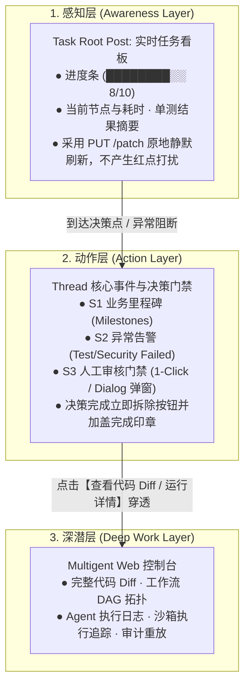
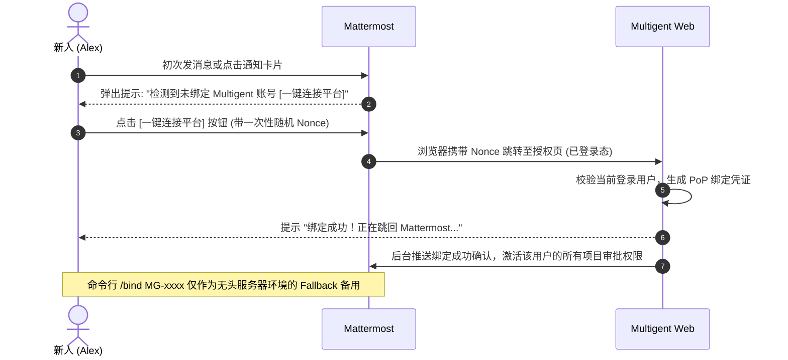

# Multigent × Mattermost: 企业级人机协作 ChatOps 架构蓝图与参考实现规范 (V2 产品重构版)

> **文档性质**: 架构基线与标准参考实现规范 (Architecture Blueprint & Standard Reference Specification)  
> **适用受众**: 平台架构师、产品负责人、新入职研发人员、接棒维护 Agent、以及希望在自身业务中构建同款 ChatOps 协作系统的其他项目团队。  
> **核心原则**: **后台可以极度复杂，前台绝不感知复杂。**  
> **关键机制**: Intent-first 意图路由 · 实时看板 (Live Card) · S0~S3 通知分级 · 领域参数决议 (Domain Resolution) · 状态/指纹双重防漂移 (Dual CAS) · 零信任持据防伪 (PoP)

---

## 1. 架构愿景与六大产品交互原则 (Vision & Product UX Principles)

传统 ChatOps 往往沦为“把命令行直接搬进群聊”，让用户去记大量复杂的命令与智能体名称。  
Multigent ChatOps 的终极愿景不是做一个“打字控制台”，而是打造一个 **环境式智能体工程工作区 (Ambient Agentic Engineering Workspace)**：
> **Agent 自己持续工作，系统默默推进，人类只在关键决策点 (Decision Point) 出现。**

为了防止系统滑向“高门槛工具人”的陷阱，本系统确立六大不可退让的产品交互原则：

```text
┌───────────────────────────────────────────────────────────────────────────┐
│                        六大产品交互设计原则                                   │
├───────────────────────────────┬───────────────────────────────────────────┤
│ 1. Task-first，Agent-second   │ 用户只聚焦任务与业务目标，无需关注背后是哪个 Agent  │
├───────────────────────────────┼───────────────────────────────────────────┤
│ 2. Intent-first，Command-second│ 主界面使用自然语言意图，Slash Command 仅作为调试逃生门│
├───────────────────────────────┼───────────────────────────────────────────┤
│ 3. 默认静默，需操作才打扰     │ 杜绝流水线每一步都发消息，避免“AI 太勤快造成通知噪音”│
├───────────────────────────────┼───────────────────────────────────────────┤
│ 4. 根帖是看板，线程是里程碑   │ Root Post 原地更新实时进度；Thread 仅记录关键里程碑 │
├───────────────────────────────┼───────────────────────────────────────────┤
│ 5. IM 做快控，控制台做深潜    │ Mattermost 承载知晓与决策；Web 控制台承载 Diff 与回放 │
├───────────────────────────────┼───────────────────────────────────────────┤
│ 6. 复杂安全完全隐藏在交互之后 │ 复杂的 Dual CAS 与密码学验签对用户表现为贴心的保护机制│
└───────────────────────────────┴───────────────────────────────────────────┘
```

---

## 2. 三层产品协同模型 (Ambient Agentic Workspace)

整个系统由浅入深划分为清晰的三层协同表面：



---

## 3. S0 ~ S3 通知分级梯队与实时看板机制

在拥有 12~20 个节点的复杂流水线中，如果每个节点的开始与结束都在 Thread 里回帖，会导致 Thread 内部迅速被刷屏炸毁。  
系统通过**通知分级机制**，将“工作流执行日志”与“业务里程碑”彻底剥离：

| 级别 | 事件类型 | Mattermost 呈现形态 | 是否打扰人类 |
|---|---|---|---|
| **S0 (Silent)** | 节点流转、工具调用、中间步骤完成 | **仅原地静默更新 Root Post 实时看板**（不产生新消息） | 🔕 零打扰 |
| **S1 (Timeline)** | 关键业务阶段完成（如需求定稿、编码收官） | **作为 Thread 回帖追加业务里程碑简报** | 📝 沉淀时间线 |
| **S2 (Notify)** | 单元测试失败、安全红线拦截、环境故障 | **Thread 告警卡片**，标明诊断原因 | ⚠️ 提醒关注 |
| **S3 (Action Required)** | 人工审核门禁、生产发布审批 | **Thread 交互卡片 + @审核人**（带审批/打回按钮） | 🔔 强提醒决策 |

### 实时看板 (Root Post Live Card) 视觉规范
任务主帖在整个生命周期中只有一条，系统使用 `PUT /api/v4/posts/{root_post_id}/patch` 保持原地刷新：

```text
🚀 [TASK-102] 登录中心双因素认证模块实现
─────────────────────────────────────────────
状态: ● 正在执行代码审核 (In Review)
进度: ████████░░ 8 / 10 步骤完成 (耗时: 4m 12s)
执行: Reviewer (Lina)
质量: ✓ 单测 142/142 全部通过  ✓ 静态安全扫描 0 风险
下一步: 架构师门禁裁决
─────────────────────────────────────────────
[🔗 在 Multigent 控制台查看完整工作流与 Diff]
```

---

## 4. 意图优先的统一分发器 (Intent-First Dispatcher)

### 4.1 双层交互模型：意图为主，命令为辅
- **普通用户模式（意图驱动，Intent-first）**：
  在任务 Thread 内部，人类直接输入自然语言，系统根据当前上下文自动推导目标 Agent：
  > 人类：“`@multigent 帮我补充一下并发锁超时的边界测试用例`”  
  > 调度器：“识别到当前处于 TASK-102 的 Code Review 阶段，自动路由给测试智能体 Lina 并在当前 Worktree 中执行。”
- **高级调试模式（命令驱动，Escape Hatch）**：
  保留单根命令空间，供管理员排错与特定定向调用：
  ```bash
  /agent <target_agent> <command>
  /multigent <subcommand>
  /mg <subcommand>
  ```

### 4.2 同名 Agent 消歧与会话上下文锁定
- **同名消歧**：当用户同时在多个项目时，`/agent lina` 若命中多个同名 Agent，系统严禁盲目执行，而是通过私信返回交互式候选菜单（`/agent proj-alpha/lina`）。
- **上下文锁定 (Context Lock)**：私聊中输入 `use mira`，后续输入全部直通 Mira，锁定状态持久化至 SQLite `interactive_sessions` 表。

---

## 5. 审批参数决议与友好防御体验

### 5.1 参数四分类体系 (Taxonomy)
1. **Evidence（客观证据）**：如 Commit SHA、测试报告。模式为 `system_locked`，界面以只读锁定徽章呈现，严禁人工篡改；
2. **Inherited Contract（继承契约）**：如需求范围、变更 PR。模式为 `inherit_or_override`，默认采纳上游，支持在 Dialog 中编辑微调；
3. **Human Decision（人工裁决）**：如目标部署环境。模式为 `human_required`，强约束弹窗录入；
4. **Human Commentary（审批附言）**：审批备注（选填）或打回理由（必填）。

### 5.2 双重防漂移 (Dual CAS) 与现代化的保护性 UX
当底层产物发生漂移时，传统的 409 报错会给用户带来挫败感。Multigent 将其重塑为**保护性产品体验**：

```text
用户点击旧卡片 ──► CAS-2 检测到 Commit SHA 已变更 (e3d4a86 ➔ f92bc17)
                     │
                     ▼
             【保护性就地更新旧卡片】
┌─────────────────────────────────────────────────────────────┐
│ ⚠️ 审批标的已发生更新 (Protected)                          │
│                                                             │
│ 系统检测到您查看卡片后，上游产物发生了 2 处变更：           │
│ • Commit 变更: `e3d4a86` ➔ `f92bc17`                        │
│ • 单测覆盖: 由 142 项增加至 147 项                          │
│                                                             │
│ 原卡片已为您保护性失效，防止误批旧代码。                   │
│ [ 🔄 刷新并查看最新待审卡片 ]                               │
└─────────────────────────────────────────────────────────────┘
```

---

## 6. 现代 PoP 账号绑定体验 (One-Click Deep-Link Connect)

坚持零信任持有证明（PoP）的防冒名红线，但将交互从“复制随机字符串”升级为“现代授权跳转”：



---

## 7. 载荷参考实现：Mattermost Blocks 架构

根据 Mattermost 最新规范，交互式消息全面推荐使用 **Blocks 原生块级协议**，传统的 Attachments 作为兼容备选。

### 7.1 现代 Blocks 审批卡片标准载荷 (Blocks Payload)

```json
{
  "channel_id": "f7jcadsbi3dhiyrkzz83hyrnbw",
  "root_id": "h6a7qga91fd53kd79a793eyxsy",
  "props": {
    "blocks": [
      {
        "type": "header",
        "text": {
          "type": "plain_text",
          "text": "⚠️ 等待人工审核: 架构与发布门禁"
        }
      },
      {
        "type": "section",
        "text": {
          "type": "mrkdwn",
          "text": "**任务**: 登录中心双因素认证模块实现\n**审查范围**: `3 files changed (+120, -10)`\n**单测结论**: `147/147 PASS`\n\n> 💡 *点击批准将直接采纳当前产物；若需调整请点击微调。*"
        }
      },
      {
        "type": "context",
        "elements": [
          {
            "type": "mrkdwn",
            "text": "📌 **Commit (已锁定)**: `f92bc17` | 👤 **审核人**: @alex"
          }
        ]
      },
      {
        "type": "actions",
        "elements": [
          {
            "type": "button",
            "text": {
              "type": "plain_text",
              "text": "✅ 批准 (Approve)"
            },
            "style": "primary",
            "action_id": "approve_gate",
            "value": "{\"action_token\":\"<HMAC_TOKEN_STRING>\"}"
          },
          {
            "type": "button",
            "text": {
              "type": "plain_text",
              "text": "✏️ 微调后批准..."
            },
            "action_id": "edit_gate",
            "value": "{\"action_token\":\"<HMAC_TOKEN_STRING_EDIT>\"}"
          },
          {
            "type": "button",
            "text": {
              "type": "plain_text",
              "text": "❌ 打回修改"
            },
            "style": "danger",
            "action_id": "reject_gate",
            "value": "{\"action_token\":\"<HMAC_TOKEN_STRING_REJECT>\"}"
          }
        ]
      }
    ]
  }
}
```

---

## 8. 安全纵深防御与网络边界

```text
外部 Webhook 传入 ──► [1. HMAC-SHA256 签名与 Nonce 防重放校验]
                         │ (2h/10m TTL，强绑定 ChannelID、PostID)
                         ▼
                       [2. 信道一致性与 DB 活跃投影校验]
                         │ (必须严格匹配 SQLite 中活跃的任务 Root Post)
                         ▼
                       [3. Mattermost REST 远端用户存在性探针]
                         │ (以 Bot Token 查验 UserID 真实存在，防伪造)
                         ▼
                       [4. 原子状态机抢占 (CAS) 与 RBAC 权限核验]
                         │ (issued -> processing -> completed)
                         ▼
                     推进领域核心工作流！
```

---

## 9. 排错手册与常见陷阱 (Troubleshooting Guide)

| 故障现象 | 根因分类 | 彻底排查与修复方法 |
|---|---|---|
| **点击卡片按钮没有任何反应，或报红框** | 网络/SSRF 阻断 | 检查 Mattermost 的 `AllowedUntrustedInternalConnections` 是否配置了 Multigent 宿主 IP (`192.168.139.231`)。若为空，Mattermost 会自动拦截所有私网 HTTP 回调。 |
| **点击按钮报：`系统未配置 CHATOPS_CALLBACK_BASE_URL`** | 守护进程环境变量缺失 | 检查 VM 的 `multigent.service` 中是否注入了 `Environment=CHATOPS_CALLBACK_BASE_URL=http://192.168.139.231:27892`。此变量缺失时系统严格 fail-closed。 |
| **用户在群里输入 `/bind` 提示找不到命令** | 触发词未在 IM 注册 | 在 Mattermost 团队中执行 `mmctl command create` 注册触发词 `bind` 与 `multigent`，将 Callback URL 指向 `/api/v1/im/mattermost/commands/bind`。 |
| **复用同一个 Bot 绑定给第二个 Agent 时报 400** | P1b 隔离机制生效 | 当前代码强制 1:1 独立 Bot 映射（`agent_channel_handlers.go:1159`）。在 Mattermost 新建一个独立 Bot 账号即可。 |

---

## 10. 演进实施路线图 (Milestones)

- **阶段 1：内网试点与基线验证（当前已就绪）**：
  保持 1:1 独立 Bot 架构，落实 Task Thread 与 Phase 2 交互式审批。
- **阶段 2：S0~S3 通知分级与 Root Card Live 看板升级**：
  改造主帖为原地 PATCH 实时看板，收敛 Thread 内流转回帖，仅保留重大里程碑与 S3 门禁。
- **阶段 3：P4 统一 Dispatcher 与 Intent 驱动**：
  单入口 `@multigent` 上线，引入自然语言意图分发，将 Slash 命令退居为调试逃生门。
- **阶段 4：一键式 Deep-Link PoP 授权与 Blocks 协议全面升级**：
  彻底淘汰传统 Attachments，全面拥抱 Mattermost Blocks 现代协议与一键授权。
